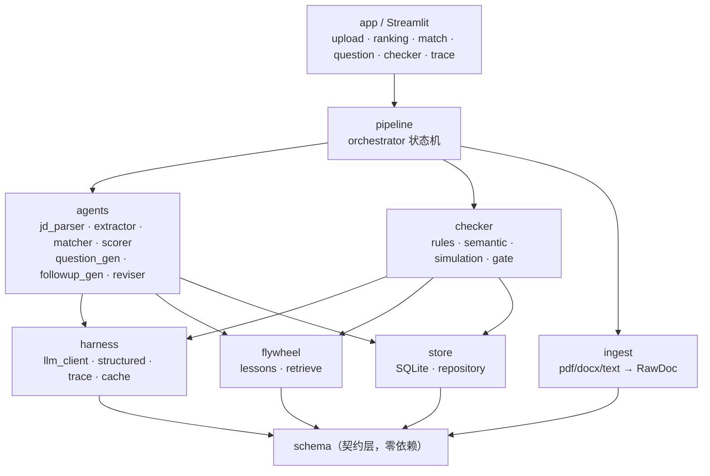
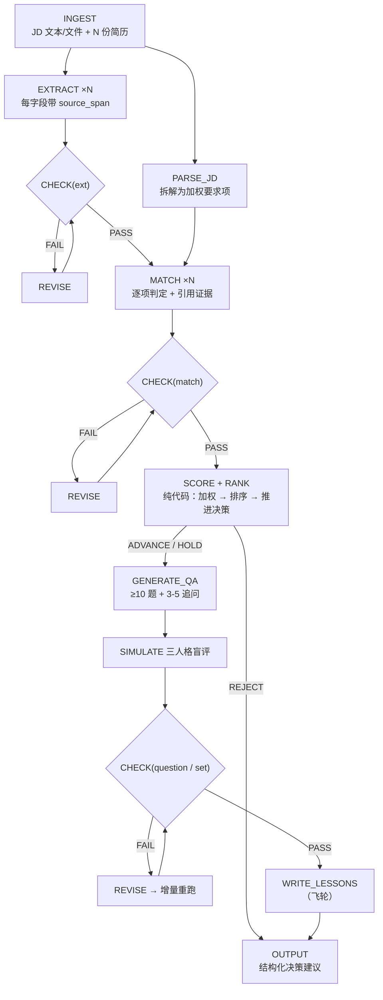

# 智能简历解析与试题生成引擎 — 架构与模块划分

> 本文档是开发前的架构约束。第六节「给 AI 编程工具的硬约束」已同步为项目根目录的 `CLAUDE.md`。
> 面向使用者的说明、评测数字与设计取舍见 [README.md](./README.md)。

---

## 零、范围声明（先读这一节）

这不是一个商业级全链路系统，目标是**一个端到端闭环的核心功能模块**：能真正跑通、每个结论都能追到出处、判定逻辑可复现。

实现按三层推进，**上一层未跑通不写下一层的代码**：

| 层 | 内容 | 状态 |
|---|---|---|
| **L1 闭环层** | 上传 → 提取 → 匹配打分与推进决策 → 候选人排序 → 试题与追问 → 规则 Checker → 修订闭环 → Streamlit 展示 | ✅ 已完成 |
| **L2 增强层** | 三人格盲评模拟；反思飞轮 | ✅ 已完成 |
| **L3 加固层** | 语义 Checker、稳定性评测、trace 面板、UI 打磨 | ✅ 已完成 |

顺序不能颠倒的原因是工程上的：任何时刻仓库里都必须有一个能跑通的 Demo。增强层的价值建立在闭环之上 —— 三人格盲评要有题可评，得先有出题；出题要有依据，得先有提取和匹配。先做深度再补闭环，中间任何一步卡住，整个项目就没有可运行的形态。

---

## 一、设计原则

1. **单向依赖**：`schema ← harness ← store/ingest ← agents/checker ← pipeline ← app`。任何反向 import 都是设计错误。
2. **Harness 独立成层**：所有 LLM 调用必须经过 `harness`，业务代码里不出现任何厂商 SDK。
3. **契约集中**：所有跨模块数据结构定义在 `schema/`，它不依赖任何其他模块。
4. **信息隔离靠类型**：`QuestionFull` / `QuestionPublic` 是两个类型，防泄题由函数签名保证，不靠 prompt 请求模型自觉。
5. **确定性优先**：能用规则校验的绝不调 LLM。**分数与决策一律由代码算出，LLM 只负责单项判定**。`Issue.detector` 字段记录来源，最终可统计「规则 vs LLM」的检出占比。
6. **配置外置**：所有阈值进 `config/thresholds.yaml`，所有 prompt 进 `prompts/*.md`，代码里不出现魔数和长字符串。
7. **闭环优先于深度**：任何时刻仓库里都必须有一个能跑通的 Demo。新增能力以不破坏闭环为前提。

---

## 二、目录结构

```
resume-screening-agent/
├── README.md                      # 交付文档：架构图 / Prompt 思路 / 难点
├── CLAUDE.md                      # 给 AI 编程工具的硬约束
├── NOTES.md                       # 开发日志，交付时提炼进 README 的「难点」
├── pyproject.toml
├── .env.example                   # 只有 key 名，无真实值
├── .gitignore                     # 必须含 .env、data/runtime/
├── Makefile                       # make install / demo / run / eval
│
├── config/
│   ├── settings.py                # pydantic-settings，读 .env
│   ├── thresholds.yaml            # 所有阈值：分数线、推进线、相似度、轮数上限
│   └── rubric.yaml                # Checker 校准维度 + 通过/不通过规则
│
├── prompts/                       # 每个 prompt 一个文件，带 version 头
│   ├── jd_parse.md                # JD → 加权要求项
│   ├── extract.md
│   ├── match.md
│   ├── question_gen.md
│   ├── followup.md
│   ├── persona_expert.md          # 三人格作答
│   ├── persona_bluffer.md
│   ├── persona_resume.md
│   ├── grader.md                  # 盲评阅卷官
│   ├── checker_semantic.md        # 语义一致性校验
│   ├── reviser.md
│   └── _archive/                  # ★ 旧版本必须留档，README 的迭代对比靠它
│       └── question_gen.v1.md
│
├── src/
│   ├── schema/                    # 契约层，零依赖
│   │   ├── document.py            # RawDoc, Chunk, SourceSpan
│   │   ├── resume.py              # ExtractedResume, Education, Project, Skill
│   │   ├── jd.py                  # JD, Requirement(weight, is_hard)
│   │   ├── match.py               # RequirementVerdict, MatchResult, Recommendation
│   │   ├── ranking.py             # ★ RankedCandidate, CandidateRanking（多简历横向对比）
│   │   ├── question.py            # QuestionFull, QuestionPublic, Rubric, QuestionSet
│   │   ├── followup.py            # AmbiguityPoint, FollowUpQuestion
│   │   ├── issue.py               # Issue, Severity, Detector, CheckReport, Gate
│   │   ├── simulation.py          # Persona, SimAnswer, SimScore, QuestionDiagnosis
│   │   ├── semantic.py            # SemanticFinding, SemanticReport
│   │   └── lesson.py              # Lesson（飞轮经验条目）
│   │
│   ├── harness/                   # ★ LLM 调用的可靠性层（四个文件，不再拆细）
│   │   ├── llm_client.py          # 统一入口 + provider 切换 + 重试退避 + 限流
│   │   ├── structured.py          # prompt 载入与变量注入 + schema 约束调用 + 校验修复重试
│   │   ├── trace.py               # 每次调用落盘：prompt / 响应 / token / 耗时 / 重试次数
│   │   └── cache.py               # 输入 hash → 结果；DEMO_MODE 回放的底座
│   │
│   ├── ingest/
│   │   ├── loader.py              # pdf / docx / 纯文本 → RawDoc（JD 支持文本框直接粘贴）
│   │   ├── chunker.py
│   │   └── normalizer.py          # 清洗页眉页脚、合并断行
│   │
│   ├── store/
│   │   ├── db.py                  # SQLite
│   │   └── repository.py          # 统一读写门面，上层只依赖这个
│   │
│   ├── agents/
│   │   ├── jd_parser.py           # JD → list[Requirement]（含 weight / is_hard）
│   │   ├── extractor.py           # 结构化提取
│   │   ├── matcher.py             # 逐项判定（分数由代码加权，见 scorer）
│   │   ├── scorer.py              # ★ 纯代码：加权求和 + 推进决策，不调 LLM
│   │   ├── question_gen.py        # 试题生成
│   │   ├── followup_gen.py        # 追问模拟
│   │   └── reviser.py             # 定向修订
│   │
│   ├── checker/
│   │   ├── base.py                # Rule 基类 + @register 注册表
│   │   ├── evidence.py            # span 模糊匹配工具（多处复用）
│   │   ├── rules/                 # detector = "rule"（两个文件，按校验性质分）
│   │   │   ├── structure_rules.py # 数量、schema、字段完整性、算术一致性
│   │   │   └── content_rules.py   # 证据存在性、归因正确性、题目重复度
│   │   ├── semantic.py            # detector = "llm"，只在规则全过后才跑
│   │   ├── simulation/            # detector = "sim" ★
│   │   │   ├── personas.py        # 三人格作答（签名只收 QuestionPublic）
│   │   │   ├── grader.py          # 盲评，标签按题打乱
│   │   │   ├── diagnose.py        # 三分对照真值表，纯代码
│   │   │   └── run.py             # 作答 -> 盲评 -> 诊断
│   │   └── gate.py                # 通过规则 + 熔断
│   │
│   ├── flywheel/
│   │   ├── lessons.py             # 写入、去重、容量控制（JSONL）
│   │   └── retrieve.py            # 按岗位类型 + issue_code 检索注入
│   │
│   ├── pipeline/
│   │   └── orchestrator.py        # 唯一的状态机
│   │
│   └── utils/
│
├── app/                           # Streamlit
│   ├── main.py
│   └── views/
│       ├── upload_view.py         # JD 文本框 + 简历多文件上传
│       ├── ranking_view.py        # ★ 首屏：候选人排序表 + 推进决策
│       ├── match_view.py          # 分项判定 + 点击理由高亮原文
│       ├── question_view.py       # 10 题 + 三人格盲评热力图
│       ├── checker_view.py        # issue 列表 + 修订前后 diff
│       ├── trace_view.py          # 调用链
│       └── history_view.py        # 历次批次回看 + 跨批次最高分
│
├── eval/
│   └── run_eval.py                # 检出占比 / 盲评诊断分布 / 分数方差
│
├── data/
│   ├── samples/                   # 1 份 JD + 3 份简历（推进 / 待定 / 淘汰各一）
│   ├── demo_cache/                # ★ 提交进仓库：DEMO_MODE 回放用
│   └── runtime/                   # traces / lessons / db（gitignore）
│
└── tests/
```

**相对初版的删减**：`harness` 由 6 个文件并为 4 个（`retry` 并入 `llm_client`，`prompt_loader` 并入 `structured`）；`checker/rules` 由 6 个并为 2 个（`@register` 注册表机制保留，那才是设计点，拆多少个文件不重要）；`store/vector.py` 移除 —— 这个规模的数据用 SQLite 足够，摆一个不用的向量库只是增加依赖。日后飞轮检索若需要语义召回，再加回不迟。

---

## 三、模块职责与依赖

| 模块 | 职责 | 可以 import |
|---|---|---|
| `schema` | 定义所有跨模块数据结构 | 无 |
| `harness` | LLM 调用的可靠性封装 | schema, config |
| `ingest` | 文档 → RawDoc | schema |
| `store` | 持久化门面 | schema |
| `agents` | 生成类业务逻辑 | schema, harness, store, flywheel |
| `checker` | 校验类业务逻辑 | schema, harness, store |
| `flywheel` | 经验沉淀与检索 | schema, store |
| `pipeline` | 编排状态机 | 以上全部 |
| `app` | 展示 | **仅 pipeline 和 schema** |

`app` 不得直接调 `agents` 或 `checker`，否则编排逻辑会散进 UI。

### 分层依赖图



---

## 四、关键接口签名

```python
# harness/structured.py —— 所有结构化输出的唯一入口
def call_structured(
    prompt_name: str,
    variables: dict,
    output_model: type[T],
    max_repair: int = 2,
) -> T: ...
# 内部：载入 prompt → 调用 → Pydantic 校验 → 失败则把报错回灌重试 → 落 trace
# DEMO_MODE=1 时：命中缓存则返回，未命中则显式抛错（绝不静默回退到真实调用）


# agents/scorer.py —— 分数与决策全部由代码算出，不经过 LLM
def aggregate_score(verdicts: list[RequirementVerdict]) -> float: ...
# 加权求和，可复现、可解释、可单测

def decide(score: float, verdicts: list[RequirementVerdict]) -> Recommendation: ...
# 判定顺序（阈值全部来自 config/thresholds.yaml）：
#   1. 任一 is_hard 且 satisfied == NO  → REJECT（硬性项一票否决）
#   2. score >= advance                → ADVANCE
#   3. score >= hold                   → HOLD
#   4. 其余                            → REJECT


# schema/match.py —— 「决定是否推进正式面试」的落点
class RequirementVerdict(BaseModel):
    requirement_id: str
    weight: float
    is_hard: bool
    satisfied: Literal["YES", "PARTIAL", "NO"]
    score: float                      # 单项 0-100
    reason: str
    evidence: list[SourceSpan]        # 空 evidence 由 Checker 判为不通过

class MatchResult(BaseModel):
    resume_id: str
    total_score: float                # 0-100，代码加权得出
    verdicts: list[RequirementVerdict]
    recommendation: Literal["ADVANCE", "HOLD", "REJECT"]
    recommendation_reason: str        # 必须引用具体的 verdict，不得空泛
    hard_requirement_failed: list[str]


# schema/ranking.py —— 多份简历的横向对比
def rank(results: list[MatchResult]) -> CandidateRanking: ...
# 按 total_score 降序；hard_requirement_failed 非空者永远沉底


# checker/simulation/personas.py —— 信息隔离靠签名保证
def answer_as_expert(questions: list[QuestionPublic], jd: JD) -> list[SimAnswer]: ...
def answer_as_bluffer(questions: list[QuestionPublic]) -> list[SimAnswer]: ...
def answer_as_resume(questions: list[QuestionPublic], resume_text: str) -> list[SimAnswer]: ...
# 三者都拿不到 QuestionFull，看不见评分标准

# checker/simulation/grader.py —— 整套题一次评完，而不是按题逐次调用
def grade_blind(questions: list[QuestionFull], answers: list[SimAnswer]) -> list[SimScore]: ...
# 标签 A/B/C 按 question_id 派生种子打乱（每题独立、结果确定），代码侧映射回 persona

# checker/simulation/diagnose.py —— 纯代码，不调 LLM
def diagnose(scores: list[SimScore], thresholds: dict) -> list[QuestionDiagnosis]: ...


# checker/gate.py
def evaluate_gate(report: CheckReport, round_no: int) -> GateResult: ...
# blocker 存在 → FAIL；major >= 3 → FAIL；major 1-2 → CONDITIONAL_PASS
# round_no >= max_rounds 且仍有 blocker → NEEDS_HUMAN_REVIEW（熔断）


# agents/reviser.py —— 按对象粒度重写，不做 JSON Patch
def revise(target_obj: BaseModel, issues: list[Issue], context: ReviseContext) -> ReviseResult: ...
# ReviseResult = {revised, changelog[], disputes[]}
```

---

## 五、编排状态机



**约束**：

- 每个 `CHECK` 后必进 `gate.evaluate_gate()`，不允许在业务代码里手写判定。
- **只对 `ADVANCE` / `HOLD` 的候选人生成试题**。被拒的候选人不出题，既符合业务逻辑，也把 LLM 调用量压下来一大截。
- `REVISE` 后**只对变更对象重跑校验**，未变更的复用上轮结论（靠 `harness/cache.py`）。
- 修订后必须重跑证据类规则（`EXT_SPAN_NOT_FOUND` / `MATCH_EVIDENCE_INVALID`），防止修订过程引入新幻觉。
- `max_rounds = 2`，超出即熔断转人工，禁止无限循环。

---

## 六、给 AI 编程工具的硬约束（已同步为 CLAUDE.md）

见 [CLAUDE.md](./CLAUDE.md)。两份文件必须保持一致，改动其一时同步另一份。

---

## 七、Checker 校准维度

维度命名沿用需求里的原词（**数据准确性**、**归因错误**），便于逐条对照。完整定义在 `config/rubric.yaml`。

| 维度 | 典型 issue_code | detector | 判定方式 |
|---|---|---|---|
| **数据准确性** | `EXT_FIELD_MISSING`、`EXT_DATE_CONFLICT`、`MATCH_ARITHMETIC_MISMATCH` | rule | 字段完整性、日期区间自洽、加权分与分项是否对得上 |
| **归因错误** | `EXT_SPAN_NOT_FOUND`、`MATCH_EVIDENCE_INVALID`、`MATCH_EVIDENCE_EMPTY` | rule | span 在原文中做模糊匹配，匹配不上即判定为无出处 |
| **格式与约束** | `Q_COUNT_LT_MIN`、`FU_COUNT_OUT_OF_RANGE`、`Q_RUBRIC_MISSING` | rule | 数量与 schema 校验 |
| **题目质量** | `Q_DUPLICATE`（rule）、`Q_NO_DISCRIMINATION`、`Q_UNANSWERABLE`、`Q_OUT_OF_RANGE`（sim） | rule / sim | 题干相似度查重 + 三人格盲评三分对照 |
| **语义一致性** | `SEM_REASON_CONTRADICTS_EVIDENCE` | llm | 前四类都判不了时才调 LLM |

### 三分对照真值表（盲评的判定核心）

| 理想专家 | 背题党 | 简历人格 | 诊断 |
|---|---|---|---|
| 高 | 低 | 高 | ✅ 好题：有区分度，且候选人确实答得上 |
| 高 | 低 | 低 | ⚠️ 偏难或超出简历射程，标记待人工确认 |
| 高 | 高 | — | ❌ 无区分度：背题即可作答 |
| 低 | — | — | ❌ 题目本身有问题：表述不清或无解 |

阈值 `expert_pass` / `bluffer_max` 在 `config/thresholds.yaml` 中定义，用少量人工标注题校准。

---

## 八、可复现性与成本

这一节的三件事 —— 无 Key 可跑、调用量可控、效果有数字 —— 都是硬约束，不是可选项。
一个跑不起来或跑一次很贵的系统，设计得再干净也没人会用。

### DEMO_MODE：无 API Key 也能跑

别人不一定愿意为了看一眼就去申请 key，复现成本越低，这个项目越可能真的被跑起来。

- `DEMO_MODE=1` 时，`harness/cache.py` 强制命中 `data/demo_cache/`，`llm_client` 不发起任何真实请求。
- **缓存未命中必须显式抛错**，绝不静默回退到真实调用 —— 否则会在别人机器上悄悄变成一次失败的请求，或伪造出假数据。
- `make demo` 即 `DEMO_MODE=1` 启动，样例数据（1 份 JD + 3 份简历）内置在 `data/samples/`。
- **三份简历刻意覆盖三档决策**：推进 / 待定 / 淘汰各一位。只配「全 YES」和「全 NO」两个极端时，
  分档阈值、`PARTIAL` 判定与 `CONDITIONAL_PASS` 放行写了也演示不出来。
- 样例还刻意保留三处不完美：首轮题目数量不足被规则打回一轮；一道题被盲评判为无区分度；
  另一道被判超出候选人射程。演示的是机制在工作，不是一份摆拍的完美结果。

缓存这一层是一处投入、三处收益：开发期不烧钱、无 Key 可复现、修订时未变更对象可复用上轮结论。

### 成本控制

按题逐次调用的话，三人格 × 10 题就是 30 次作答，加上盲评、提取、匹配、生成、校验、修订，跑一次上百次调用。因此：

- **每个人格一次答完整套题，阅卷官一次评完所有答案** —— 模拟的调用量压到每轮 4 次，与题目数量无关。
- **确定性规则先跑**：题目数量不足这类 blocker 一出现就跳过模拟，这套题马上要被重写。
- `cache.py` 属于 **L1**，不是优化项。开发期反复调试全靠它。
- 区分 `LLM_MODEL` 与 `LLM_MODEL_CHEAP`：作答、提取、出题用快模型，匹配判定与盲评用强模型。
- `SIMULATION_ENABLED=0` 可整体关掉盲评，不影响 L1 闭环。

### Prompt 迭代留证

**旧版本必须当场归档到 `prompts/_archive/`** —— 事后回忆改过什么，写出来的东西一定是空的。每次实质性修改 prompt 时同步做三件事：归档旧版、version 号加一、在 `NOTES.md` 记一句改动原因和观察到的效果。

### 数字化证据

只说「做了幻觉与格式错误的处理」不值钱，给得出数字才值钱。以下全部由 `eval/run_eval.py` 从 trace 与实际运行中统计，`make eval` 可当场重跑：

- 结构化输出一次成功率 / 回灌重试后成功率
- 规则 vs 盲评 vs LLM 的 issue 检出占比（按各轮累计检出算，不是最终报告）
- 三人格盲评的诊断分布
- 同一份简历跑 N 次的总分方差（回放模式下恒为 0，会明确标注）

---

## 九、开发顺序

### L1 闭环层（做完即有可运行的 Demo）

| 阶段 | 内容 | 完成标志 |
|---|---|---|
| 0 | schema + harness + cache + 假数据 | `call_structured` 能返回校验通过的对象，且第二次调用命中缓存 |
| 1 | ingest + jd_parser + extractor + store | 上传 PDF 与 JD，能看到带 `source_span` 的 JSON |
| 2 | matcher + scorer + ranking | 多份简历出排序表，分数与推进决策由代码算出，可复现 |
| 3 | question_gen + followup_gen | 端到端跑通 |
| 4 | checker/rules + gate + reviser | 规则类 issue 能检出，修订前后 diff 可见 |
| 5 | Streamlit 五个页面 + `make demo` | **克隆后一条命令看到完整结果** |

### L2 增强层

| 阶段 | 内容 | 完成标志 | 状态 |
|---|---|---|---|
| 6 | simulation 三人格 + 盲评 + 诊断 | 题目热力图出来，能指出哪道题无区分度 | ✅ |
| 7 | flywheel | 第二次运行时能看到经验被检索注入 | ✅ |

### L3 加固层

| 阶段 | 内容 | 状态 |
|---|---|---|
| 8 | `eval/run_eval.py`、trace_view、UI 打磨 | ✅ |
| 9 | semantic checker（detector = llm） | ✅ |

---

## 十、README 的写法约定

README 面向的是第一次打开这个仓库的人。约定如下，改 README 时对照检查：

1. **先让人跑起来**：快速启动三条命令以内，且第一条路径必须是无 Key 模式。
2. **架构用 Mermaid**：GitHub 原生渲染，不放外链图片。
3. **Prompt 那一节必须有真实的前后对比**，素材来自 `prompts/_archive/` 和 `NOTES.md`。
   没有真发生过的迭代就不写 —— 编一个出来比空着更糟。
4. **难点写真实记录**，同样来自 `NOTES.md`，当场记的才写得具体。
5. **数字必须可复现**：凡是写进 README 的指标，都要能用 `make eval` 或 `make test`
   当场跑出来。跑不出来的指标不写占位符，直接说明为什么没有。
6. **未实现的东西不进能力表**，统一写在「已知局限」里，逐条说清楚缺什么。
7. **对自己不利的数字照写**：规则 vs LLM 检出占比、盲评的循环论证风险、
   没有测试覆盖的路径 —— 藏起来只会在被追问时更难看。
