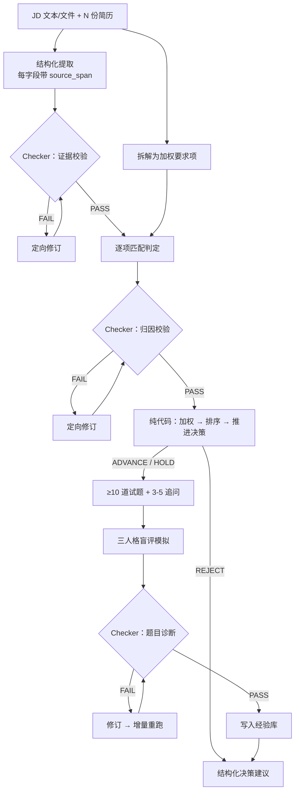
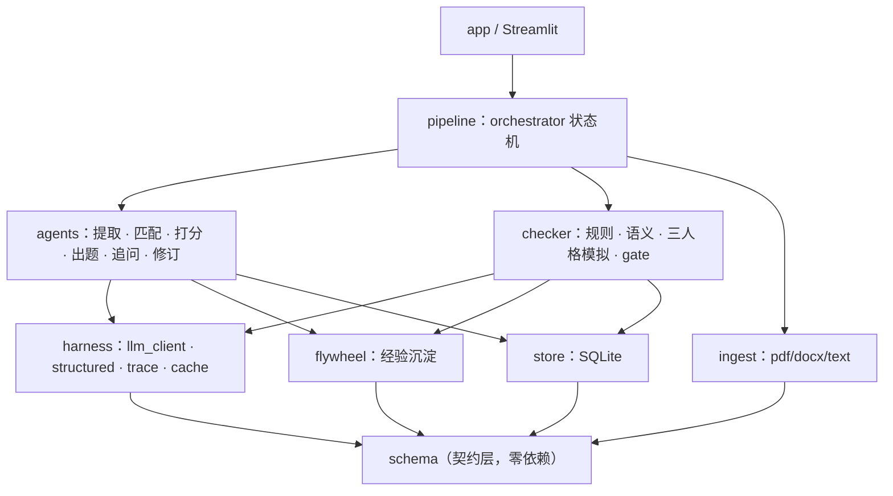

# 智能简历解析与试题生成引擎

输入一份 JD 与若干份简历（PDF / Word），输出**可审计**的匹配评分、是否推进面试的决策建议、针对性面试题目与追问，并由独立的 Checker Agent 校验后闭环修订。

> **当前状态**：L1 端到端闭环已完成。内置 Demo 可在无 API Key、无网络请求的情况下
> 完整展示 JD 拆解、两份简历提取与排序、匹配依据、10 道题、3 个追问、Checker
> 发现问题并修订一轮，以及 SQLite 持久化和调用链。
> 完整架构约束见 [ARCHITECTURE.md](./ARCHITECTURE.md)。

---

## 快速开始

环境要求：Python 3.9+

```bash
git clone https://github.com/1367877593-ops/resume-screening-agent.git
cd resume-screening-agent
make install && make test
make demo
```

`make demo` **无需 API Key**：它以 `DEMO_MODE=1` 启动，使用固定的
`demo / demo-v1` 命名空间回放 `data/demo_cache/`。即使本机 `.env` 配置了其他
provider 或模型，也不会初始化真实客户端。浏览器打开 `http://localhost:8501`，
点击「一键运行内置 Demo」即可载入固定样例并看到完整结果；该操作也会清除
文件选择器中残留的自定义上传，避免误触发缓存未命中。

内置样例会故意让首轮只生成 9 道题：规则 Checker 报出 `Q_COUNT_LT_MIN`，
Reviser 补齐第 10 道后重新校验通过。这样 Demo 实际展示了“发现问题 → 反馈 →
修订 → 复检”的闭环，而不是只展示一份预先准备好的最终报告。

需要用 DeepSeek V4 Pro 跑自己的数据：

```bash
make install
make configure-live     # Key 在终端中隐藏输入，安全写入本地 .env
make live-check         # 一次极小真实请求，验证鉴权和模型名
make run
```

默认实时模型为官方标识 `deepseek-v4-pro`，接口地址为
`https://api.deepseek.com`。结构化任务默认关闭 thinking，并把单次响应限制在
8192 tokens，以减少延迟并给费用设置硬上限。项目仍支持 OpenAI / Claude /
DeepSeek / Qwen / Kimi，在 `.env` 里切换 `LLM_PROVIDER`，业务代码无感知
（见下文 Harness 层）。

安全约束：`.env` 已被 Git 忽略并以 `0600` 权限写入；配置脚本使用隐藏输入，
Key 不进入命令行参数或 shell 历史；错误信息在进入 UI 前会再次脱敏。不要通过
聊天、截图或录屏分享 Key，也不要使用 `git add -f .env`。

## 分享给别人使用

推荐发布为带访问口令的 Streamlit Web Demo。使用者打开网页即可上传 JD 和
简历；DeepSeek Key 只保存在云端 Secret 中，不会发送到浏览器或 GitHub。
项目已包含部署依赖、上传限制、访问口令门禁与 Secret 模板，具体步骤见
[DEPLOYMENT.md](./DEPLOYMENT.md)。

| 命令 | 作用 |
|---|---|
| `make demo` | 无 Key 回放演示 |
| `make demo-cache` | 重建并验证内置 Demo 缓存 |
| `make configure-live` | 隐藏输入 Key，配置 DeepSeek V4 Pro 实时模式 |
| `make live-check` | 用极小请求验证真实模型连接，不输出 Key |
| `make install` | 安装依赖 |
| `make run` | 接真实模型启动 |
| `make eval` | 输出稳定性与诊断准确率 |
| `make test` | 跑单元测试 |

---

## 核心能力

| 模块 | 能力 |
|---|---|
| 结构化提取 | 解析简历并抽取关键信息，每个字段携带原文出处（`source_span`） |
| 匹配打分 | JD 拆解为加权要求项，逐条判定并引用证据；**分数与推进决策由代码算出，不由 LLM 给** |
| 候选人排序 | 多份简历横向对比，硬性要求未满足者一票否决 |
| 试题生成 | 生成 ≥10 道面试题，含考察点、难度、分档评分标准 |
| 追问模拟 | 识别简历模糊点，生成 3–5 个针对性追问 |
| Checker Agent | L1 确定性规则校验、统一 Gate、最多两轮定向修订与熔断转人工 |
| 结构化存储 | SQLite 保存完整运行结果与候选人索引，支持历史回看和跨批次排序查询 |

---

## 架构

### 数据流



### 模块划分

依赖严格单向：`schema ← harness ← store/ingest ← agents/checker ← pipeline ← app`



`app` 只能 import `pipeline` 和 `schema`，编排逻辑不散进 UI。各模块职责表见 [ARCHITECTURE.md](./ARCHITECTURE.md#三模块职责与依赖)。

---

## 设计亮点

### Harness 独立成层

所有 LLM 调用必须经过 `harness.structured.call_structured()`，`agents/` 与 `checker/` 下**禁止**出现任何厂商 SDK。这一层集中处理四件事：provider 切换、结构化输出的校验与修复重试、全量 trace 落盘、输入 hash 缓存。

换模型只改一个环境变量；调试时重跑不烧钱；每一次调用的 prompt、响应、token、耗时、重试次数都可回溯。

### 证据链驱动

每一条结论都必须挂原文出处。说不出出处的结论由 Checker 直接判为不通过 —— 用确定性的字符串匹配拦截幻觉与归因错误，而不是再问一次模型「你确定吗」。

### 分数由代码算

LLM 只做单项判定（满足 / 部分满足 / 不满足）与理由，**总分由 `agents/scorer.py` 加权求和，推进决策由阈值规则给出**。硬性要求未满足一票否决。因此分数可复现、可解释、可单测，不会因为模型今天心情不同而漂移。

### 三人格模拟验题（L2 规划）

题目生成后，由「理想专家 / 背题党 / 简历人格」三个 Agent 在信息隔离条件下作答，盲评打分后三分对照：

| 理想专家 | 背题党 | 简历人格 | 诊断 |
|---|---|---|---|
| 高 | 低 | 高 | ✅ 好题 |
| 高 | 低 | 低 | ⚠️ 偏难或超出简历射程 |
| 高 | 高 | — | ❌ 无区分度，背题即可答 |
| 低 | — | — | ❌ 题目本身有问题 |

这一层不属于当前完成的 L1。契约已经通过 `QuestionFull.to_public()` 为后续信息隔离留好边界，
但三人格执行器和盲评尚未实现，README 不把规划冒充为已交付功能。

### 反思飞轮（L2 规划）

计划将 Checker 问题沉淀为经验库，并按岗位类型与 `issue_code` 检索注入。
当前 L1 已完成本次运行内的 check/revise 闭环，尚未实现跨运行经验检索。

---

## Checker 校准维度

维度命名采用需求原词，完整定义见 `config/rubric.yaml`。

| 维度 | 典型 issue_code | detector | 判定方式 |
|---|---|---|---|
| 数据准确性 | `EXT_FIELD_MISSING`、`MATCH_ARITHMETIC_MISMATCH` | rule | 字段完整性、日期自洽、加权分与分项一致 |
| 归因错误 | `EXT_SPAN_NOT_FOUND`、`MATCH_EVIDENCE_EMPTY` | rule | span 在原文模糊匹配，匹配不上即无出处 |
| 格式与约束 | `Q_COUNT_LT_10`、`FU_COUNT_OUT_OF_RANGE` | rule | 数量与 schema 校验 |
| 题目质量 | `Q_NO_DISCRIMINATION`、`Q_DUPLICATE` | sim / rule | 三分对照 + 相似度查重 |
| 语义一致性 | `SEM_REASON_CONTRADICTS_EVIDENCE` | llm | 前四类判不了时才调 LLM |

**通过 / 不通过规则**（`checker/gate.py`，业务代码内不得手写判定）：

- 存在 `blocker` → FAIL
- `major` ≥ 3 → FAIL
- `major` 1–2 → CONDITIONAL_PASS
- 修订轮数达上限仍有 blocker → NEEDS_HUMAN_REVIEW（熔断转人工）

---

## Prompt 设计思路

Prompt 只负责模型擅长的语义判断，能确定性完成的工作全部留在代码侧：

1. **提取 Prompt 强制逐字证据**：`extract.md` 要求每个结构化字段携带
   `evidence.text`，且必须是原文连续片段。Checker 再把引用拿回原文核对，避免用
   “再问一次模型”来验证模型。
2. **匹配 Prompt 不允许给总分**：`match.md` 只返回每条要求的
   `YES / PARTIAL / NO`、单项分和理由；加权总分、硬性要求一票否决、推进决策均由
   `agents/scorer.py` 计算，保证可复现。
3. **出题 Prompt 把验收条件写入 Schema 边界**：`question_gen.md` 明确最少 10 道、
   难度分布、三档评分标准和简历证据。输出仍要经过数量、rubric、出处和题干查重规则；
   Demo 中首轮 9 道题会被真实打回修订。
4. **统一结构化修复**：所有 Prompt 都通过 `call_structured()` 加载、注入变量并附加
   JSON Schema。Pydantic 校验失败时，具体错误会回灌给模型，最多修复两次；每次调用
   都记录 prompt 版本、缓存键、耗时和修复次数。

Prompt 文件都带 `version`。实质性修改时先归档旧版本再升级 version，避免新 Prompt
误用旧缓存；缓存键同时包含 Prompt 名、版本、Schema、模型和完整输入。

---

## 评测结果

阶段 5 完成时的可复现验收结果：

- `make test`：**96 项全部通过**，覆盖 Harness、缓存、Gate/修订循环、代码算分、
  排序、SQLite、API 序列化以及内置 Demo 端到端回放。
- Demo：2 份样例简历，李明 95.0 分推进面试，王芳因三项硬性要求不满足而淘汰。
- 推进候选人：10 道题、3 个追问；题目阶段由 9 道触发一次规则修订，复检后通过。
- 回放调用：8 个结构化缓存条目；Demo 模式下缓存命中率 100%，不初始化真实模型客户端。
- 浏览器验收：五个标签页均已实际点击，排序表、证据高亮、题目/rubric、修订记录和
  调用链均可正常渲染。

真实模型的“一次成功率、修复后成功率和 token/耗时”必须在配置真实 Key 后从 trace
统计，当前不编造这组数字。`make eval` 属于后续 L3 加固范围。

---

## 难点与解决方案

### 1. Demo 缓存在命中前错误初始化真实客户端

旧流程先按 `.env` 构造 provider 客户端，再查 Demo 缓存。评审者如果保留了
`LLM_PROVIDER=deepseek` 但没有 Key，明明有缓存也会先报鉴权错。现在无显式 client 的
Demo 使用固定 `demo / demo-v1` 命名空间，先查只读缓存；命中不构造客户端，未命中则
抛出 `CacheMissError`，绝不静默转成真实请求。对应行为有回归测试。

### 2. 集成测试数据被题干查重规则正确拦截

阶段 5 最初的十道测试题只替换序号，题干主体几乎相同，因此 Checker 判定重复并进入
修订，导致模拟响应队列耗尽。修复没有放宽查重阈值，而是让测试题真正覆盖需求分析、
数据治理、检索、评测、接口、监控等不同能力；严格规则得以保留。

### 3. 无 Key Demo 既要稳定，也不能绕过主状态机

直接在前端塞一份静态 JSON 虽然容易，但无法证明 Agent 编排、Checker、代码算分和
SQLite 真正工作。当前缓存只替代模型响应，回放仍完整经过 Pydantic Schema、编排状态机、
规则 Checker、Reviser、scorer、排序和持久化；Prompt、Schema 或样例变化后缓存键会失效，
必须通过 `make demo-cache` 显式重建并复测。

---

## 已知局限

- **用 LLM 验证 LLM 存在循环论证风险**。缓解措施：能用确定性规则判断的一律不调 LLM（数量、schema、算术、字符串匹配、相似度），`Issue.detector` 字段如实记录每条问题的来源，README 中公开规则与 LLM 的检出占比 —— 如果绝大多数问题都靠 LLM 检出，说明这套校验的可信度有限，这个数字不藏。
- L2 三人格模拟与跨运行反思飞轮尚未实现；当前交付范围是完整可运行的 L1 闭环。
- Demo 缓存只覆盖 `data/samples/` 的两份样例；上传自定义文件需关闭 Demo 模式并配置真实模型。
- PDF 解析对复杂排版（多栏、表格化简历）的鲁棒性有限。
- 图片型 PDF 暂不支持 OCR，会明确报错而不是返回空结果。

---

## 交付物对照

| 要求 | 位置 | 状态 |
|---|---|---|
| 可运行源代码 | 本仓库 | ✅ |
| 简单命令启动 Demo | `make demo`（无需 API Key） | ✅ |
| 演示视频 ≥2 分钟 | 见仓库 Release / 文末链接 | 待录制 |
| 架构图与数据流 | 本文「架构」一节 | ✅ |
| Prompt 设计思路 | 本文「Prompt 设计思路」一节 | ✅ |
| 难点与解决方案 | 本文「难点与解决方案」一节 | ✅ |
| 敏感信息用 .env 管理 | `.env.example` + `.gitignore` | ✅ |

---

## 文档

- [ARCHITECTURE.md](./ARCHITECTURE.md) — 架构设计、接口签名、开发顺序
- [CLAUDE.md](./CLAUDE.md) — AI 编程辅助工具的项目约束
- [NOTES.md](./NOTES.md) — 开发日志
