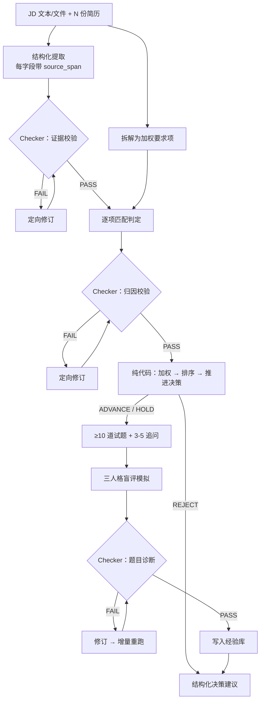
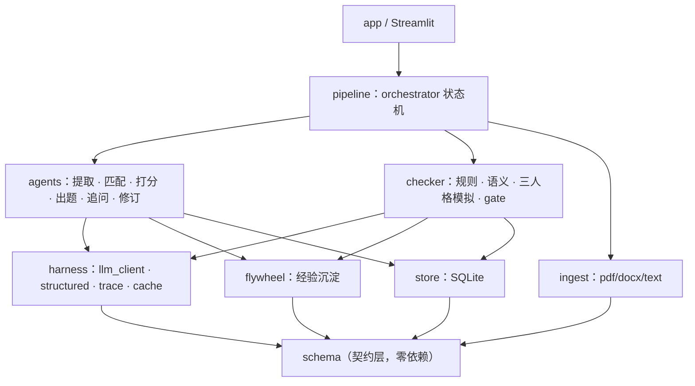

# 智能简历解析与试题生成引擎

输入一份 JD 与若干份简历（PDF / Word），输出**可审计**的匹配评分、是否推进面试的决策建议、针对性面试题目与追问，并由独立的 Checker Agent 校验后闭环修订。

> **当前状态**：架构设计已完成，开发中。标注「待补充」的章节会随开发进度填入真实数据，不预先编写。
> 完整架构约束见 [ARCHITECTURE.md](./ARCHITECTURE.md)。

---

## 快速开始

环境要求：Python 3.11+

```bash
git clone https://github.com/1367877593-ops/resume-screening-agent.git
cd resume-screening-agent
make demo
```

`make demo` **无需 API Key** —— 它以 `DEMO_MODE=1` 启动，回放仓库内置的调用缓存（`data/demo_cache/`）与样例数据（1 份 JD + 4 类简历），浏览器打开 `http://localhost:8501` 即可看到完整结果。

需要用真实模型跑自己的数据：

```bash
cp .env.example .env    # 填入 API Key，.env 已在 .gitignore 中
make install
make run
```

支持 OpenAI / Claude / DeepSeek / Qwen / Kimi，在 `.env` 里切换 `LLM_PROVIDER`，业务代码无感知（见下文 Harness 层）。

| 命令 | 作用 |
|---|---|
| `make demo` | 无 Key 回放演示 |
| `make install` | 安装依赖 |
| `make run` | 接真实模型启动 |
| `make eval` | 输出稳定性与诊断准确率 |
| `make test` | 跑单元测试 |

---

## 核心能力

| 模块 | 能力 |
|---|---|
| 结构化提取 | 解析简历并抽取关键信息，每个字段携带原文出处（`source_span`） |
| 匹配打分 | JD 拆解为加权要求项，逐条判定并引用证据；**分数与推进决策由代码算出，不由 LLM 给** |
| 候选人排序 | 多份简历横向对比，硬性要求未满足者一票否决 |
| 试题生成 | 生成 ≥10 道面试题，含考察点、难度、分档评分标准 |
| 追问模拟 | 识别简历模糊点，生成 3–5 个针对性追问 |
| Checker Agent | 静态规则校验 + 语义校验 + 三人格模拟压测，闭环修订 |

---

## 架构

### 数据流



### 模块划分

依赖严格单向：`schema ← harness ← store/ingest ← agents/checker ← pipeline ← app`



`app` 只能 import `pipeline` 和 `schema`，编排逻辑不散进 UI。各模块职责表见 [ARCHITECTURE.md](./ARCHITECTURE.md#三模块职责与依赖)。

---

## 设计亮点

### Harness 独立成层

所有 LLM 调用必须经过 `harness.structured.call_structured()`，`agents/` 与 `checker/` 下**禁止**出现任何厂商 SDK。这一层集中处理四件事：provider 切换、结构化输出的校验与修复重试、全量 trace 落盘、输入 hash 缓存。

换模型只改一个环境变量；调试时重跑不烧钱；每一次调用的 prompt、响应、token、耗时、重试次数都可回溯。

### 证据链驱动

每一条结论都必须挂原文出处。说不出出处的结论由 Checker 直接判为不通过 —— 用确定性的字符串匹配拦截幻觉与归因错误，而不是再问一次模型「你确定吗」。

### 分数由代码算

LLM 只做单项判定（满足 / 部分满足 / 不满足）与理由，**总分由 `agents/scorer.py` 加权求和，推进决策由阈值规则给出**。硬性要求未满足一票否决。因此分数可复现、可解释、可单测，不会因为模型今天心情不同而漂移。

### 三人格模拟验题

题目生成后，由「理想专家 / 背题党 / 简历人格」三个 Agent 在信息隔离条件下作答，盲评打分后三分对照：

| 理想专家 | 背题党 | 简历人格 | 诊断 |
|---|---|---|---|
| 高 | 低 | 高 | ✅ 好题 |
| 高 | 低 | 低 | ⚠️ 偏难或超出简历射程 |
| 高 | 高 | — | ❌ 无区分度，背题即可答 |
| 低 | — | — | ❌ 题目本身有问题 |

把「题目质量」从主观感受变成可测量信号。**防泄题由类型签名保证** —— 三个作答函数的参数类型只能是 `QuestionPublic`，拿不到含评分标准的 `QuestionFull`，不依赖 prompt 里的自然语言约束。

### 反思飞轮

Checker 每次发现的问题沉淀为经验库，下次生成时按岗位类型与 issue_code 检索注入，形成越用越准的闭环。

---

## Checker 校准维度

维度命名采用需求原词，完整定义见 `config/rubric.yaml`。

| 维度 | 典型 issue_code | detector | 判定方式 |
|---|---|---|---|
| 数据准确性 | `EXT_FIELD_MISSING`、`MATCH_ARITHMETIC_MISMATCH` | rule | 字段完整性、日期自洽、加权分与分项一致 |
| 归因错误 | `EXT_SPAN_NOT_FOUND`、`MATCH_EVIDENCE_EMPTY` | rule | span 在原文模糊匹配，匹配不上即无出处 |
| 格式与约束 | `Q_COUNT_LT_10`、`FU_COUNT_OUT_OF_RANGE` | rule | 数量与 schema 校验 |
| 题目质量 | `Q_NO_DISCRIMINATION`、`Q_DUPLICATE` | sim / rule | 三分对照 + 相似度查重 |
| 语义一致性 | `SEM_REASON_CONTRADICTS_EVIDENCE` | llm | 前四类判不了时才调 LLM |

**通过 / 不通过规则**（`checker/gate.py`，业务代码内不得手写判定）：

- 存在 `blocker` → FAIL
- `major` ≥ 3 → FAIL
- `major` 1–2 → CONDITIONAL_PASS
- 修订轮数达上限仍有 blocker → NEEDS_HUMAN_REVIEW（熔断转人工）

---

## Prompt 设计思路

> 待补充。历史版本归档在 `prompts/_archive/`，此处将贴 2–3 个关键 prompt 的迭代前后对比，说明改动动机与稳定性变化（失败率数字来自 trace 统计）。

---

## 评测结果

> 待补充。全部数字由 `make eval` 从 trace 统计产出：

- 结构化输出一次成功率 / 回灌重试后成功率
- 证据类规则拦截的无出处结论条数
- 规则 vs LLM 的 issue 检出占比
- 同一份简历跑 N 次的总分方差

---

## 难点与解决方案

> 待补充。开发过程中的真实记录见 [NOTES.md](./NOTES.md)，交付时从中提炼。

---

## 已知局限

- **用 LLM 验证 LLM 存在循环论证风险**。缓解措施：能用确定性规则判断的一律不调 LLM（数量、schema、算术、字符串匹配、相似度），`Issue.detector` 字段如实记录每条问题的来源，README 中公开规则与 LLM 的检出占比 —— 如果绝大多数问题都靠 LLM 检出，说明这套校验的可信度有限，这个数字不藏。
- 三人格模拟的诊断阈值需要人工标注题校准，标注集规模有限，阈值可能过拟合。
- PDF 解析对复杂排版（多栏、表格化简历）的鲁棒性有限。

---

## 交付物对照

| 要求 | 位置 | 状态 |
|---|---|---|
| 可运行源代码 | 本仓库 | 开发中 |
| 简单命令启动 Demo | `make demo`（无需 API Key） | 开发中 |
| 演示视频 ≥2 分钟 | 见仓库 Release / 文末链接 | 待录制 |
| 架构图与数据流 | 本文「架构」一节 | ✅ |
| Prompt 设计思路 | 本文「Prompt 设计思路」一节 | 待补充 |
| 难点与解决方案 | 本文「难点与解决方案」一节 | 待补充 |
| 敏感信息用 .env 管理 | `.env.example` + `.gitignore` | ✅ |

---

## 文档

- [ARCHITECTURE.md](./ARCHITECTURE.md) — 架构设计、接口签名、开发顺序
- [CLAUDE.md](./CLAUDE.md) — AI 编程辅助工具的项目约束
- [NOTES.md](./NOTES.md) — 开发日志
