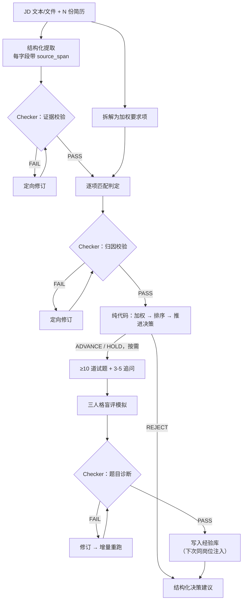
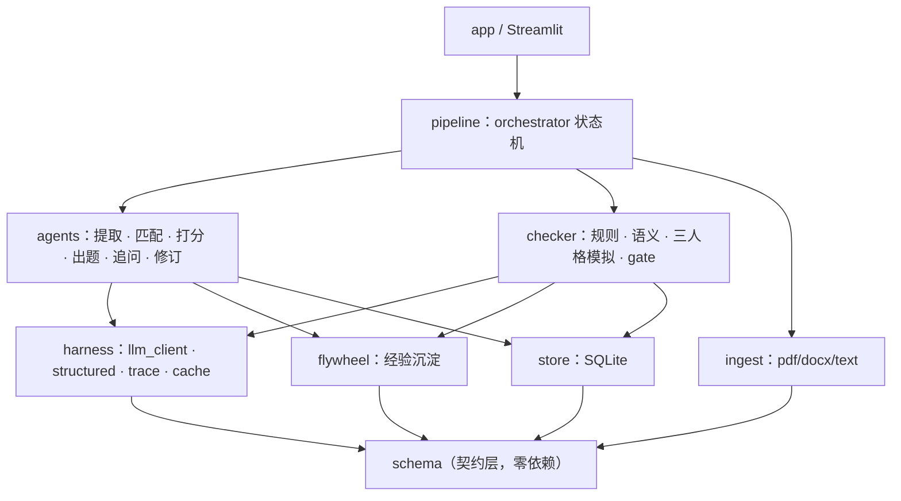

# 智能简历解析与试题生成引擎

[](https://github.com/1367877593-ops/resume-screening-agent/actions/workflows/test.yml)

输入一份 JD 与若干份简历（PDF / Word），输出**可审计**的匹配评分、是否推进面试的决策建议、针对性面试题目与追问，并由独立的 Checker Agent 校验后闭环修订。

> **当前状态**：端到端闭环 + 三人格盲评已完成。内置 Demo 可在无 API Key、无网络请求的
> 情况下完整展示 JD 拆解、三份简历的提取与排序（推进 / 待定 / 淘汰各一）、匹配依据、
> 每人 10 道题与 3 个追问、Checker 发现问题并修订一轮、三人格盲评抓出两类不合格的题，
> 以及 SQLite 持久化、历史回看和调用链。
> 完整架构约束见 [ARCHITECTURE.md](./ARCHITECTURE.md)。

---

## 快速开始

环境要求：Python 3.9+

```bash
git clone https://github.com/1367877593-ops/resume-screening-agent.git
cd resume-screening-agent
make install && make test
make demo
```

`make demo` **无需 API Key**：它以 `DEMO_MODE=1` 启动，使用固定的
`demo / demo-v1` 命名空间回放 `data/demo_cache/`。即使本机 `.env` 配置了其他
provider 或模型，也不会初始化真实客户端。浏览器打开 `http://localhost:8501`，
点击「一键运行内置 Demo」即可载入固定样例并看到完整结果；该操作也会清除
文件选择器中残留的自定义上传，避免误触发缓存未命中。

内置样例是一份 JD 加三份对比鲜明的简历，**三档决策各一位**：李明 95.0 推进、
陈涛 64.6 待定（硬性项全部踩线满足，软性项半数只是部分满足）、王芳 14.6 因三项
硬性要求不满足一票否决。分档阈值写在 `config/thresholds.yaml`，不这样配样例的话，
「待定」和「部分满足」这两档写了也演示不出来。

样例还刻意保留了三处不完美：

1. 首轮只生成 9 道题 —— 规则 Checker 报出 `Q_COUNT_LT_MIN`，Reviser 补齐第 10 道后复检通过。
2. 李明那套题里「服务突发超时怎么分层排查」被盲评判为 `Q_NO_DISCRIMINATION`：
   背题党靠通用面经也能答得不错。
3. 陈涛那套题里「改成向量检索怎么评估召回」被判 `Q_OUT_OF_RANGE`：题目本身有区分度，
   但他简历里明说没用过向量数据库，超出他的射程。

Demo 展示的是「发现问题 → 反馈 → 修订 → 复检」的闭环和质量诊断在工作，
而不是一份预先准备好的完美报告。

需要用 DeepSeek V4 Pro 跑自己的数据：

```bash
make install
make configure-live     # Key 在终端中隐藏输入，安全写入本地 .env
make live-check         # 两次极小真实请求，验证鉴权与快慢两档模型名
make run
```

默认实时模型为官方标识 `deepseek-v4-pro`，接口地址为 `https://api.deepseek.com`。
`make live-check` 会把**快慢两档模型各探一次** —— 只验其中一个会给出虚假信心：
流水线第一步（JD 拆解）走的是快模型，它的标识写错时，只验关键模型的检查照样报成功。结构化任务默认关闭 thinking，并把单次响应限制在
8192 tokens，以减少延迟并给费用设置硬上限。实时筛选采用混合模型：JD 拆解、
简历提取、面试题和追问先走 `deepseek-v4-flash`，关键匹配判断与 Checker 修订
保留 `deepseek-v4-pro`；候选人最多两路并行。首次筛选只返回排名与匹配详情，
面试题在结果页按候选人生成，避免为暂时不查看的人提前等待和付费。项目仍支持 OpenAI / Claude /
DeepSeek / Qwen / Kimi，在 `.env` 里切换 `LLM_PROVIDER`，业务代码无感知
（见下文 Harness 层）。

安全约束：`.env` 已被 Git 忽略并以 `0600` 权限写入；配置脚本使用隐藏输入，
Key 不进入命令行参数或 shell 历史；错误信息在进入 UI 前会再次脱敏。不要通过
聊天、截图或录屏分享 Key，也不要使用 `git add -f .env`。

## 分享给别人使用

推荐发布为带访问口令的 Streamlit Web Demo。使用者打开网页即可上传 JD 和
简历；DeepSeek Key 只保存在云端 Secret 中，不会发送到浏览器或 GitHub。
项目已包含部署依赖、上传限制、访问口令门禁与 Secret 模板，具体步骤见
[DEPLOYMENT.md](./DEPLOYMENT.md)。

| 命令 | 作用 |
|---|---|
| `make demo` | 无 Key 回放演示 |
| `make demo-cache` | 重建并验证内置 Demo 缓存 |
| `make configure-live` | 隐藏输入 Key，配置 DeepSeek V4 Pro 实时模式 |
| `make live-check` | 用极小请求验证快慢两档模型的连接，不输出 Key |
| `make install` | 安装依赖 |
| `make run` | 接真实模型启动 |
| `make eval` | 统计检出占比、盲评诊断分布与分数稳定性 |
| `make test` | 跑单元测试 |

---

## 核心能力

| 模块 | 能力 |
|---|---|
| 结构化提取 | 解析简历并抽取关键信息，每个字段携带原文出处（`source_span`） |
| 匹配打分 | JD 拆解为加权要求项，逐条判定并引用证据；**分数与推进决策由代码算出，不由 LLM 给** |
| 候选人排序 | 多份简历横向对比，硬性要求未满足者一票否决 |
| 试题生成 | 生成 ≥10 道面试题，含考察点、难度、分档评分标准 |
| 追问模拟 | 识别简历模糊点，生成 3–5 个针对性追问 |
| Checker Agent | 确定性规则校验 + 语义一致性校验、统一 Gate、最多两轮定向修订与熔断转人工 |
| 题目质量诊断 | 三人格盲评模拟，把「题出得好不好」变成可测量信号，无区分度的题会被打回 |
| 反思飞轮 | Checker 的问题按岗位沉淀为经验库，下次同岗位出题前注入，第二次运行不再重复同一个错误 |
| 结构化存储 | SQLite 保存完整运行结果与候选人索引；界面「历史记录」页可回看历次批次，并跨批次按总分查最高分候选人 |

---

## 架构

### 数据流



### 模块划分

依赖严格单向：`schema ← harness ← store/ingest ← agents/checker ← pipeline ← app`



`app` 只能 import `pipeline` 和 `schema`，编排逻辑不散进 UI。各模块职责表见 [ARCHITECTURE.md](./ARCHITECTURE.md#三模块职责与依赖)。

---

## 设计亮点

### Harness 独立成层

所有 LLM 调用必须经过 `harness.structured.call_structured()`，`agents/` 与 `checker/` 下**禁止**出现任何厂商 SDK。这一层集中处理四件事：provider 切换、结构化输出的校验与修复重试、全量 trace 落盘、输入 hash 缓存。

换模型只改一个环境变量；调试时重跑不烧钱；每一次调用的 prompt、响应、token、耗时、重试次数都可回溯。

### 证据链驱动

每一条结论都必须挂原文出处。说不出出处的结论由 Checker 直接判为不通过 —— 用确定性的字符串匹配拦截幻觉与归因错误，而不是再问一次模型「你确定吗」。

### 分数由代码算

LLM 只做单项判定（满足 / 部分满足 / 不满足）与理由，**总分由 `agents/scorer.py` 加权求和，推进决策由阈值规则给出**。硬性要求未满足一票否决。因此分数可复现、可解释、可单测，不会因为模型今天心情不同而漂移。

### 三人格模拟验题

「这道面试题出得好不好」通常只能靠主观感受，进不了自动化闭环。这里把它变成可测量的信号：
同一套题交给三个信息量不同的人格作答，阅卷官在不知道谁是谁的情况下打分，再看三个分数的**相对关系**。

| 理想专家 | 背题党 | 简历人格 | 诊断 |
|---|---|---|---|
| 高 | 低 | 高 | ✅ 好题 |
| 高 | 低 | 低 | ⚠️ 超出这位候选人的射程 |
| 高 | 高 | — | ❌ 无区分度，背题即可答 |
| 低 | — | — | ❌ 题目本身有问题 |

判定用的是相对关系而不是绝对分：模型今天给分松、明天给分紧，只要三个人格在同一次盲评里打出来，
关系就是稳的。真值表实现在 `checker/simulation/diagnose.py`，**纯代码不调 LLM**，阈值来自
`config/thresholds.yaml`，可单测。

四个工程细节：

- **防泄题由类型签名保证。** 三个作答函数的题目参数类型都是 `QuestionPublic`，它只有
  `question_id` 和 `text` 两个字段，评分标准根本不在这个类型里。要给人格多喂信息，
  必须先去 schema 里加字段 —— 那是一次会被 review 看到的显式改动，而不是 prompt 里
  一句「请不要偷看」。
- **标签按题独立打乱。** 一次调用评十道题，如果 A 全程都是专家，模型从前几题就能推断出身份。
- **打乱必须确定性。** 用 `random.shuffle()` 会让同样的输入每次生成不同 prompt，
  缓存键跟着漂移，无 Key 回放就永远命中不了。种子由 `question_id` 派生。
- **确定性规则先跑。** 题目数量不足这类 blocker 一出现就跳过模拟 —— 这套题马上要被重写，
  对它盲评四次纯属烧钱。

调用量是每轮 4 次（三次作答 + 一次盲评），与题目数量无关。`SIMULATION_ENABLED=0` 可关闭，
关掉不影响 L1 闭环。

### 语义校验：唯一一处「用 LLM 验证 LLM」

归因规则能确认「这句引用确实逐字出现在简历里」，但确认不了「这句引用是否**撑得起**
这个结论」。模型完全可能引用一句真实存在的原文，却给出它撑不住的判定 ——
引用「了解 Python 基础」然后判「精通 Python」，字符串匹配全过。

这是规则天然判不了的一类错误，所以这里破例调 LLM，但接入方式上做了四处收敛：

- **排在最后**：只在确定性规则全部通过后才跑。出现 blocker 时那批判定马上要被重写，
  对它做语义分析是纯浪费。
- **只送检有证据的判定**：没有证据的 YES/PARTIAL 归因规则已经拦下了。
- **prompt 要求保守**：拿不准就放过。误报会触发修订、把本来正确的结论改坏，
  代价比漏报高得多。
- **判 major 而非 blocker**：一条不打回，攒够三条才触发重写。

内置样例里埋了一条真实的矛盾：陈涛 R5 的理由写着「有系统的 Prompt 多版迭代与效果
评估经验」，而它引用的原文恰恰是「没有做过多版对比或效果评估」。规则查不出来，
语义校验判 `SEM_REASON_CONTRADICTS_EVIDENCE`，gate 给 `CONDITIONAL_PASS` ——
留痕交人工过目，不自动改。

调用量为每位候选人 1 次，`SEMANTIC_CHECK_ENABLED=0` 可关闭。

### 反思飞轮

Checker 每次发现的问题不该只用一次。同一个岗位反复筛人时，模型会反复犯同一类错误 ——
题数不够、题干重复、证据引用不完整。这些问题按 (岗位, `issue_code`) 去重合并进经验库，
下次同岗位生成前检索注入出题 prompt。

内置样例连跑两次就能看到效果：

| | 第一次 | 第二次 |
|---|---|---|
| 出题结果 | 只给 9 道，被 `Q_COUNT_LT_MIN` 打回 | 一次给足 10 道 |
| 修订轮数 | 1 | **0** |

整个飞轮只有一条硬约束：**注入内容必须稳定**。条目里存着命中次数和时间戳，但渲染进
prompt 的只有去重排序后的告诫文本 —— 带上 hits 的话，每跑一次 prompt 就变一次，
缓存键全部漂移，无 Key 回放会直接失效。

**它没有解决什么**：跑三次之后，`Q_COUNT_LT_MIN` 的命中数停在 1（没再犯），而
`Q_NO_DISCRIMINATION` 和 `Q_OUT_OF_RANGE` 累加到 3。也就是说，注入经验能消除
「数量不够」这类可确定性描述的重复失误，但消除不了题目区分度这类主观质量问题 ——
后者仍然要靠盲评每轮去抓。

不额外消耗调用，`FLYWHEEL_ENABLED=0` 可关闭。

---

## Checker 校准维度

维度命名采用需求原词，完整定义见 `config/rubric.yaml`。

| 维度 | 典型 issue_code | detector | 判定方式 |
|---|---|---|---|
| 数据准确性 | `EXT_FIELD_MISSING`、`MATCH_ARITHMETIC_MISMATCH` | rule | 字段完整性、日期自洽、加权分与分项一致 |
| 归因错误 | `EXT_SPAN_NOT_FOUND`、`MATCH_EVIDENCE_EMPTY` | rule | span 在原文模糊匹配，匹配不上即无出处 |
| 格式与约束 | `Q_COUNT_LT_MIN`、`FU_COUNT_OUT_OF_RANGE` | rule | 数量与 schema 校验 |
| 题目质量 | `Q_DUPLICATE`（rule）、`Q_NO_DISCRIMINATION`、`Q_UNANSWERABLE`、`Q_OUT_OF_RANGE` | rule / sim | 相似度查重 + 三人格盲评三分对照 |
| 语义一致性 | `SEM_REASON_CONTRADICTS_EVIDENCE` | llm | 前四类判不了时才调 LLM：引用逐字存在，但撑不起结论 |

**通过 / 不通过规则**（`checker/gate.py`，业务代码内不得手写判定）：

- 存在 `blocker` → FAIL
- `major` ≥ 3 → FAIL
- `major` 1–2 → CONDITIONAL_PASS
- 修订轮数达上限仍有 blocker → NEEDS_HUMAN_REVIEW（熔断转人工）

---

## Prompt 设计思路

Prompt 只负责模型擅长的语义判断，能确定性完成的工作全部留在代码侧：

1. **提取 Prompt 强制逐字证据**：`extract.md` 要求每个结构化字段携带
   `evidence.text`，且必须是原文连续片段。Checker 再把引用拿回原文核对，避免用
   “再问一次模型”来验证模型。
2. **匹配 Prompt 不允许给总分**：`match.md` 只返回每条要求的
   `YES / PARTIAL / NO`、单项分和理由；加权总分、硬性要求一票否决、推进决策均由
   `agents/scorer.py` 计算，保证可复现。
3. **出题 Prompt 把验收条件写入 Schema 边界**：`question_gen.md` 明确最少 10 道、
   难度分布、三档评分标准和简历证据。输出仍要经过数量、rubric、出处和题干查重规则；
   Demo 中首轮 9 道题会被真实打回修订。
4. **统一结构化修复**：所有 Prompt 都通过 `call_structured()` 加载、注入变量并附加
   JSON Schema。Pydantic 校验失败时，具体错误会回灌给模型，最多修复两次；每次调用
   都记录 prompt 版本、缓存键、耗时和修复次数。

Prompt 文件都带 `version`。实质性修改时先归档旧版本再升级 version，避免新 Prompt
误用旧缓存；缓存键同时包含 Prompt 名、版本、Schema、模型和完整输入。

### 一次真实的迭代：`question_gen.md` v1 → v2

三人格盲评上线后第一次跑内置样例，就把出题 Prompt 的一个漏洞照出来了。

被判不合格的是 Q9：**「服务突发超时，你会怎样区分模型、检索和接口层的问题？」**
背题党拿到 71 分，超过 `bluffer_max=50`，判定 `Q_NO_DISCRIMINATION`。

问题在于，这道题**不违反 v1 的任何一条规则**：

```diff
  2. 题目必须**扎在这份简历的具体内容上**。
     反例：「请介绍一下你对 RAG 的理解」—— 这题问谁都一样，没有区分度。
```

Q9 确实挂在简历里写过的 FastAPI 上，所以顺利通过。**判据本身错了**——
「有没有引用简历内容」和「答题需不需要本人经历」是两件事，分层排查是通用套路，
挂谁的简历上都能问。

v2 把判据换成一条可证伪的自检：

```diff
+ 2. **每出一道题，先自检一遍：一个只刷过面经、没有任何真实项目经历的人，
+    能不能把这道题答得像模像样？能，就作废重写。**
+
+    仅仅提到简历里的技术栈是不够的 —— 判据不是「有没有挂在简历上」，
+    而是「不调用本人经历能不能答」。
+
+    反例：「服务突发超时，你会怎样区分模型、检索和接口层的问题？」——
+    虽然简历里写了这套技术栈，但分层排查是通用套路，背过就能答。
+
+    合格的题必须至少逼出下列之一：**具体数字与其口径、做了什么取舍以及为什么、
+    踩过的具体坑、个人职责与他人贡献的边界**。
```

这条自检和背题党人格的评分口径是同一个，等于让出题侧直接对齐校验侧的判据。
旧版归档在 `prompts/_archive/question_gen.v1.md`。

**但这个改动只降低发生率，不消灭问题。** 内置 Demo 特意保留了 Q9 仍被判出的那一幕：
如果把 prompt 写清楚就够了，就不需要校验层了。效果看 `make eval` 的诊断分布，
不看 prompt 写得多漂亮。

---

## 评测结果

全部数字由 `make eval` 从 trace 与实际运行中统计产出，可当场重跑：

```bash
make eval                       # 无 Key，回放内置样例
RUNS=5 DEMO_MODE=0 make eval    # 接真实模型跑 5 次，得到有意义的方差
```

**Checker 检出来源**（「用 LLM 验证 LLM」风险的直接度量）：

| detector | 条数 | 占比 |
|---|---|---|
| rule（确定性规则） | 1 | 25.0% |
| sim（三人格盲评） | 2 | 50.0% |
| llm（语义校验） | 1 | 25.0% |

四分之三的检出不依赖 LLM 判断 —— 数量、schema、算术、字符串匹配、相似度由确定性
规则完成，题目质量由三分对照完成，只有「证据撑不撑得起结论」这一类交给 LLM。
这个数字不藏：如果哪天 llm 那一档占了大头，说明这套校验的可信度需要重新评估。

三档都非零本身也是有意义的 —— 任何一档长期为 0，都说明那条路径没写或没被触发，
这时候的占比说明不了任何问题。内置样例刻意让三档各触发一次。

统计口径有一处必须说明：占比算的是**各轮累计检出**，不是最终报告。第 0 轮被规则抓到、
随后修好的问题也算检出 —— 只统计最终报告会把已修复的规则类检出全部抹掉，反而让
这套校验显得主要靠 LLM。

**三人格盲评诊断**（内置样例两位推进候选人共 20 道题）：好题 18 道（90%）、
无区分度 1 道、超出射程 1 道。被标出的两道不需要人工逐条看，且两者不合格的原因不同。

**其余**：

- `make test`：**179 项全部通过**，覆盖 Harness、缓存原子写与并发、trace 归属、Gate/修订循环、
  代码算分、排序、SQLite、API 序列化、PDF/Word 解析、三人格信息隔离与真值表边界、
  连接检查的报错翻译，以及内置 Demo 端到端回放。CI 在 Python 3.9 与 3.12 上各跑一遍。
- Demo：3 份样例简历，推进 / 待定 / 淘汰三档各一位，覆盖 `PARTIAL` 判定与 `CONDITIONAL_PASS` 放行。
- 回放调用：25 个结构化缓存条目（含第二轮运行，用于展示飞轮），命中率 100%，全程不初始化真实模型客户端。

**没有的数字**：真实模型的一次成功率、修复后成功率、token 与耗时，需要配置 Key 后
从 trace 统计。回放模式下这几项恒为「无真实调用」，不拿缓存命中冒充成功率。

同理，回放模式下的分数方差恒为 0 —— 那是缓存的性质，不是模型的性质，`make eval`
会在输出里明确标注这一点。

---

## 难点与解决方案

### 1. Demo 缓存在命中前错误初始化真实客户端

旧流程先按 `.env` 构造 provider 客户端，再查 Demo 缓存。使用者如果保留了
`LLM_PROVIDER=deepseek` 但没有 Key，明明有缓存也会先报鉴权错。现在无显式 client 的
Demo 使用固定 `demo / demo-v1` 命名空间，先查只读缓存；命中不构造客户端，未命中则
抛出 `CacheMissError`，绝不静默转成真实请求。对应行为有回归测试。

### 2. 集成测试数据被题干查重规则正确拦截

阶段 5 最初的十道测试题只替换序号，题干主体几乎相同，因此 Checker 判定重复并进入
修订，导致模拟响应队列耗尽。修复没有放宽查重阈值，而是让测试题真正覆盖需求分析、
数据治理、检索、评测、接口、监控等不同能力；严格规则得以保留。

### 3. 无 Key Demo 既要稳定，也不能绕过主状态机

直接在前端塞一份静态 JSON 虽然容易，但无法证明 Agent 编排、Checker、代码算分和
SQLite 真正工作。当前缓存只替代模型响应，回放仍完整经过 Pydantic Schema、编排状态机、
规则 Checker、Reviser、scorer、排序和持久化；Prompt、Schema 或样例变化后缓存键会失效，
必须通过 `make demo-cache` 显式重建并复测。

---

## 已知局限

- **用 LLM 验证 LLM 存在循环论证风险**。缓解措施：能用确定性规则判断的一律不调 LLM（数量、schema、算术、字符串匹配、相似度），`Issue.detector` 字段如实记录每条问题的来源，占比公开在上面的「评测结果」里 —— 如果绝大多数问题都靠 LLM 检出，说明这套校验的可信度有限，这个数字不藏。
- **三人格盲评与语义校验都是模型在评模型**，只是把它约束成了信息量对照实验：判定看三个分数的相对关系而非绝对分，人格拿不到评分标准，阅卷官拿不到身份。这降低了循环论证的程度，没有消除它。诊断阈值目前按经验取值，没有人工标注集校准，可能对当前样例过拟合。
- 飞轮的经验按岗位标题粗粒度归一（去标点转小写）匹配，标题写法差异大时会被当成两个岗位；语义级聚类需要向量检索，这个规模上不值得。
- 飞轮只能消除可确定性描述的重复失误（数量、格式、引用），消除不了题目区分度这类主观质量问题。
- Demo 缓存只覆盖 `data/samples/` 的三份样例；上传自定义文件需关闭 Demo 模式并配置真实模型。
- 历史记录页载入旧批次后只能查看，不能再「按需生成面试题」—— 落库的是展示用 payload，不含流水线中间状态。
- PDF 解析对复杂排版（多栏、表格化简历）的鲁棒性有限。解析路径本身有测试覆盖（含 Word 表格、空文本报错），但没有覆盖真实世界的复杂排版样本。
- 图片型 PDF 暂不支持 OCR，会明确报错而不是返回空结果。
- 落库的 payload 含简历原文，且多人共用同一份库、没有按用户隔离。公网部署应设 `PERSIST_RUNS=0` 只在内存出结果（见 [DEPLOYMENT.md](./DEPLOYMENT.md)）；这是规避而不是解决。
- trace 的 tracer 是进程级全局。同一进程里两次运行完全并发时，后启动的会改写全局引用，先启动的剩余调用会被记到后者名下。单机与 Streamlit 单会话用法下不会发生，彻底解决需要把 tracer 沿调用链显式传递。

---

## 文档

- [ARCHITECTURE.md](./ARCHITECTURE.md) — 架构设计、接口签名、开发顺序
- [CLAUDE.md](./CLAUDE.md) — AI 编程辅助工具的项目约束
- [NOTES.md](./NOTES.md) — 开发日志
